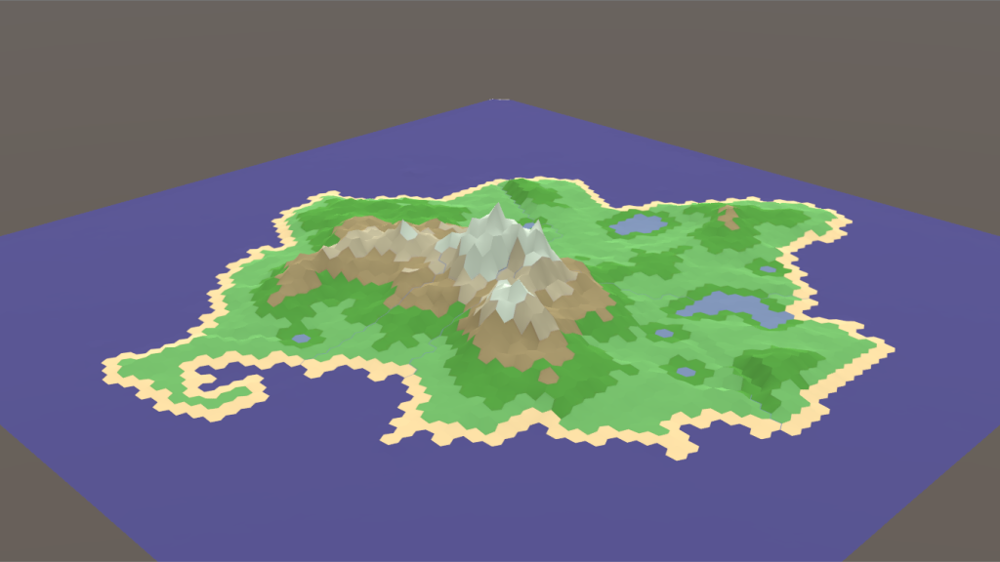
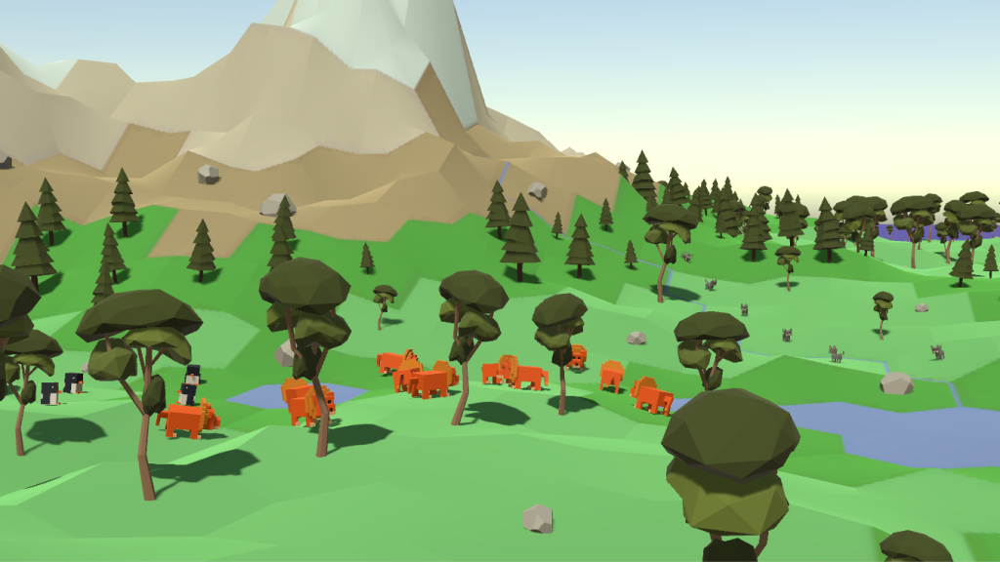

# EcoSim

I began this project with the intention of becoming familiar with [Unity](https://unity.com/) and simulations.

This was all inspired and made possible by:

- [Sebastian Lague's "Procedural Terrain Generation" series]  
- [Red Blob Games]  
- [Voronoi Map Generator]  
- ["Primer" videos]  

## Procedural Terrain Generation

After completing the *Procedural Terrain Generation* series, I happened to stumble upon the *Voronoi Map Generator* project. I used this project as a new starting point, and stripped out all the cruft that I felt was not relevant to this particular project.

After tweaking a bunch of settings, I had an island that I was reasonably happy with. There are definitely problems with this portion of the project (my mesh generation has some... oddities); in the future the mesh and texture generation will likely be improved, however it's fine for the time being.

## Environment

With an island generated, I decided it was time to implement a simple day/night cycle. This was done using a custom Skybox material, a pair of directional lights, and a simple moon texture. Essentially the sun and moon, both directional lights, always face the center of the scene and rotate around the center point at a configured speed. This is an incredibly simple implementation but it's more than adequate for my application.

Next I thought the island could use a little more personality, so I spawned some trees and rocks using a free [low-poly texture pack] in the Asset Store (I'm no artist). There are two types of trees, a coniferous and a deciduous; coniferous trees are spawned in the `TallGrass` nodes, which are at higher elevations, and deciduous in the standard `Grass` nodes. This algorithm will likely be updated to be a bit more interesting in the future. Rocks can spawn on either `TallGrass`, `Grass`, or `Rocky` types nodes. Trees and rocks have randomized deviations on both their scales and rotations.

## Animals

In this nonsensical land, there exist 5 types of animals: Cats, Chickens, Dogs, Lions, and Penguins. Again, these are all from an asset pack ([animated voxel animals]), since I can't be bothered to model anything myself. We're just going to pretend any of this makes sense.

For each species, a random initial spawn point is chosen. After each spawn, the spawn point is moved to a valid neighbouring node, or if one cannot be found a new random spawn is chosen and the algorithm continues merrily on its way. This means there may be distinct clusters of the same species in differing locations on the map.

All species share a number of core attributes, such as health, movement speed, etc.

[Sebastian Lague's "Procedural Terrain Generation" series]: https://www.youtube.com/playlist?list=PLFt_AvWsXl0eBW2EiBtl_sxmDtSgZBxB3
[Red Blob Games]: https://www.redblobgames.com
[Voronoi Map Generator]: https://github.com/SteveJohnstone/VoronoiMapGen
["Primer" videos]: https://www.youtube.com/channel/UCKzJFdi57J53Vr_BkTfN3uQ/videos
[low-poly texture pack]: https://assetstore.unity.com/packages/3d/free-low-poly-pack-65375
[animated voxel animals]: https://assetstore.unity.com/packages/3d/characters/animals/5-animated-voxel-animals-145754
